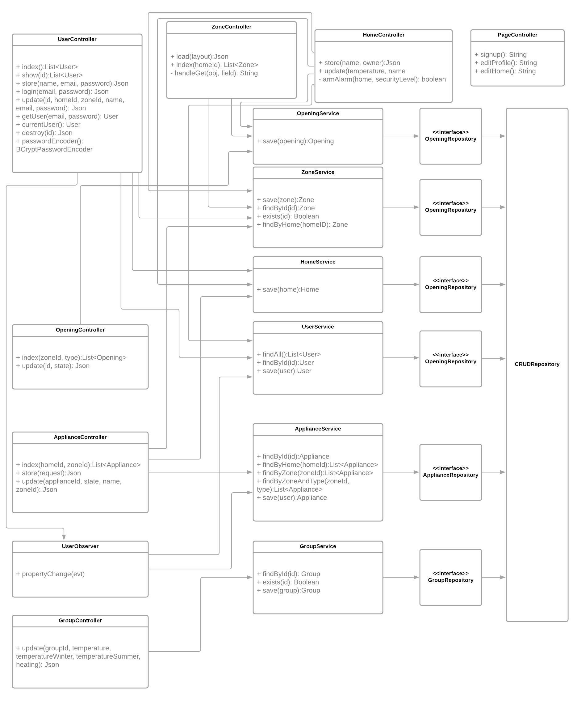

# Smart Home Simulator
A Java REST API built on SpringBoot + Maven and VueJs for the front end that simulates the operation of a smart home.

This project allows you to open, close, and Lock windows, control HVAC systems, control weather outside the home, manage modules, and more.

### Purpose
This project satisfies the requirements of SOEN 343 - Software Architecture and Design @ Concordia University 

## Installation
There are a number of dependencies for this project, Primarily Java and Node. The following will walk you through the 
required build and installation steps

### Java
For this project to work you need Java 11 installed.

Be sure to check that the correct version of java is not already installed. To do so, run:
```
java -version
```


#### MacOs
- First you'll need [Homebrew](https://brew.sh/), if you don't already have it installed
```bash
/bin/bash -c "$(curl -fsSL https://raw.githubusercontent.com/Homebrew/install/master/install.sh)"
```
- Oracle no longer supports the Java JDK Cask, but The AdoptOpenJDK JDK's are still available, and they're built from the same codebase as Oracle's JDK; 
just packaged differently. So tap those casks and install the appropriate Java version.
```
brew tap adoptopenjdk/openjdk
brew cask install adoptopenjdk11
```

#### Windows
- Windows lacks a centralized package manager, that is widely supported, so just go ahead and download the JDK directly from Oracle.
You can [get it here](https://www.oracle.com/java/technologies/javase-downloads.html#JDK11)
- Next, Start the JDK 11 installer by double-clicking the installer's icon or file name in the download location. 
- Follow the instructions provided by the Installation wizard. 
- For convenience, make sure your `PATH` variable is set properly: 
  - Select Control Panel and then System.
  - Click Advanced and then Environment Variables.
  - Add the location of the bin folder of the JDK installation to the PATH variable in System Variables.
  - Note that the typical value for the `PATH` variable is: `C:\WINDOWS\system32;C:\WINDOWS;"C:\Program Files\Java\jdk-11\bin"`

*A Portion of these instructions were taken from the oracle help pages, [here](https://docs.oracle.com/en/java/javase/11/install/installation-jdk-microsoft-windows-platforms.html#GUID-371F38CC-248F-49EC-BB9C-C37FC89E52A0)*.
If you need more comprehensive information, be sure to visit that page. 

### MySql
- Required Version: `^5.7`

This project also requires a MySql Database to be running. For ease of setup, MySQL has been containerized.
To run MySQL for this project, install [Docker by following the documentation](https://docs.docker.com/get-docker/)

once installed, start the Docker Daemon and run the following commands from the root of the project:
```
cd schema
# For MacOS and Linux
docker-compose up -d

# For windows
docker-compose.exe up -d
``` 
The container should now be running and available at `localhost:3307`. The database `smart-home-simulator` will be pre-created, but will have no schema.

Connect to the database with the username `root` and password `root` via a MySQL Client, and import the .sql file found at `schema/smart-home-simulator.sql`

Alternatively if you already have MySQL:5.7 installed, simply create a database called `smart-home-simulator` and import the above schema.

**NOTE:** the application.properties.example file has been preconfigured out of the box to run with **Docker**.
if you are not using the Docker set-up provided you **must** change the application.properties to reflect your system set-up

### Node
- Required Version: `^14.0`

Node is a Javascript runtime, its package manager holds all of our front end dependencies.

Visit the Node [download page](https://nodejs.org/en/download/), and download the relevant installer for your system.
After installation is complete ensure that NodeJS is on your `PATH`. You can check this by running:
```bash
node -v # Should be  v14.13.1
npm -v # Should be 6.14.8
```

if you are running a linux distribution, like Ubuntu, you can use a package manager.
```bash
sudo apt update
sudo apt install nodejs
```

For any systems not covered here, refer to the NodeJS [documentation](https://nodejs.org/en/download/package-manager/) 

### Application Properties
Once set up, you'll need to add your database credentials to the `application.properties` file.
```
# For MacOS
cp application.properties.example application.properties

# for Windows
copy application.properties.example application.properties
```

make sure to fill the `application.properties` with the appropriate credentials. 


## Usage 
To  run the project, you'll want to build it first. To do that, `cd` into the project directory and run:

```bash
# For MacOS
./mvnm spring-boot:run 

# For Windows
./mvnw.cmd spring-boot:run #Window
``` 

Maven will build the java files and start a local server at http://localhost:8080
From there you can hit just about any end point in the application.


## Design
A portion of the requirements for this project involve designing a robust and documented system.
Below is a Domain Diagram that describes the models and their relationships, a class diagram that shows which classes call which,
as well as a sequence diagram the illustrates the flow a user might take when navigating the system.

### Domain Model


### Class Diagram



## Support 
Some Useful guides and information for using Spring, Vue, and other technology used in the project can be found here:

- [Building a RESTful service with SpringBoot](https://spring.io/guides/gs/rest-service/)
- [The VueJS Documentation](https://vuejs.org/v2/guide/) 
- [Google Java Style Guide](https://google.github.io/styleguide/javaguide.html)
